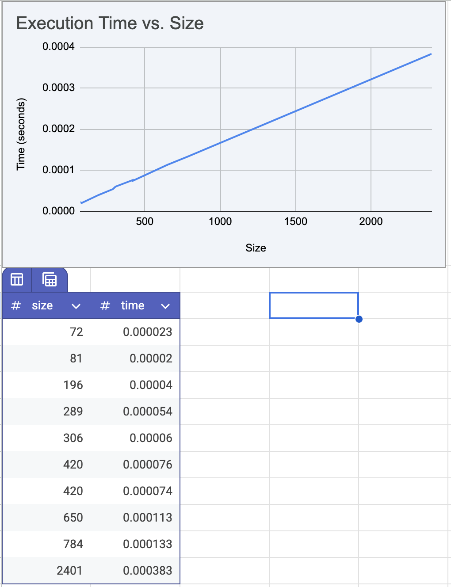

# Highest Value Longest Common Subsequence — Programming Assignment 3

## Student Information
- **Name:** Grecia Ocando
- **UFID:** 34457048

## Description
Given two strings A and B and an alphabet where each character has a value, this program finds the common subsequence that maximizes total character value using dynamic programming.

## How to Run

### Run the solver
```
python3 src/HVLCS.py
```
The program will prompt you for:
```
Enter input file:  example.in
Enter output file: example.out
```

## Project Structure
```
├── README.md
├── src/
│   └── HVLCS.py               # Main program
├── q1/
│   ├── q1.py                  # Runtime Test for Question 1
│   ├── input1.in - input10.in # Test input files
│   ├── results.txt            # Results of test
│   └── runtime.png            # Runtime graph
├── example.in                 # Input Example
└── example.out                # Output Example
```

## Input Format
```
K
x1 v1
x2 v2
...
xK vK
A
B
```
- K is the number of characters in the alphabet
- Each of the next K lines contains a character and its integer value
- A is the first string
- B is the second string

## Output Format
```
<max_value>
<optimal_subsequence>
```

## Question 1 — Empirical Comparison

Use at least 10 nontrivial input files (i.e., contain strings of length at least 25). Graph the runtime of the 10 files.



### Run Question 1
```
cd q1
python3 q1.py
```
This runs the HVLCS algorithm on all 10 input files in `q1/` and saves results to `q1/results.txt`.

## Question 2 — Recurrence Equation

Give a recurrence that is the basis of a dynamic programming algorithm to compute the
HVLCS of strings A and B. You must provide the appropriate base cases, and explain why
your recurrence is correct.

```
OPT(i, j) = maximum value of a common subsequence of A[1..i] and B[1..j]
```

**Base cases:**
```
OPT(i, 0) = 0    for all i
OPT(0, j) = 0    for all j
```

**Recurrence:**
```
OPT(i, j) = 0                                   if i = 0 or j = 0
          = v(A[i]) + OPT(i−1, j−1)             if A[i] = B[j]
          = max( OPT(i−1, j), OPT(i, j−1) )     if A[i] != B[j]
```

**Why it's correct:** At each position (i, j), if A[i] equals B[j] we include that character, gain its value, 
and move to the smaller subproblem OPT(i−1, j−1). If they do not match, no pairing is possible so we take the maximum of skipping A[i] with OPT(i−1, j) or skipping B[j] with OPT(i, j−1), keeping whichever gives the higher total value. The base cases return 0 because a common subsequence with an empty string has no characters and therefore no value.

**Answer = OPT(m, n)**

## Question 3 — Big-Oh

**Pseudocode:**
Give pseudocode of an algorithm to compute the maximum value of the HVLCS given strings A and B. What is the runtime of your algorithm?
```
Input: strings A, B, alphabet values val
for i = 0 to m:   M[i][0] = 0
for j = 0 to n:   M[0][j] = 0

for i = 1 to m:
    for j = 1 to n:
        if A[i] == B[j]:
            M[i][j] = v(A[i]) + M[i-1][j-1]
        else:
            M[i][j] = max(M[i-1][j], M[i][j-1])

return M[m][n]
```

**Runtime: O(mn)**
The algorithm fills an (m+1) × (n+1) table where m = |A| and n = |B|. Each cell takes O(1) to compute since it only looks at three previously computed values. Filling the entire table requires m × n iterations, giving a total time complexity of O(mn) and a space complexity of O(mn) for storing the table.